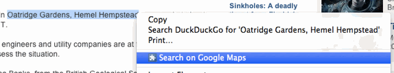

# Chrome extension - Google Maps

Adds a right-click menu option to search with selected text on Google Maps

## Install

* In Chrome, open [chrome://extensions](chrome://extensions)
* Enable `Developer mode`
* Click `Load unpacked extension`
* Navigate to the `src` directory and select

## Credits

[Tomo Programming blog post](http://tomoprogramming.blogspot.com.au/2013/08/simple-tutorial-for-chrome-extension.html)
